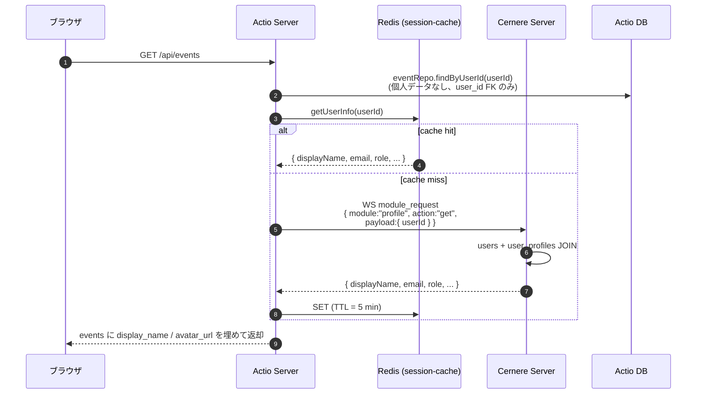
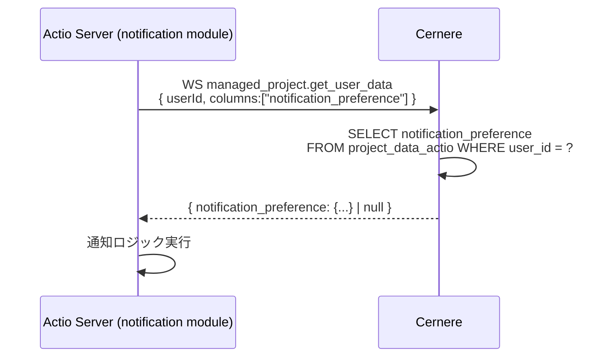
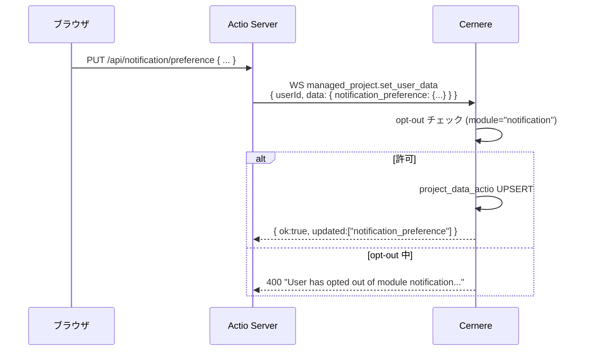

# Actio データスキーマ

Actio の DB と、Cernere に預けているユーザデータの責務分離・スキーマ定義をまとめた資料。

## 1. 設計方針

LUDIARS の **個人データ保管禁止ルール** (AIFormat §5) に従い、Actio は次の二層構造を取る:

```
┌──────────────────────────────────────────────────────────────┐
│  Cernere (single source of truth)                            │
│  ・ユーザ識別情報 (name / email / role / OAuth トークン)         │
│  ・Actio 専用ユーザ設定 (project_data_actio テーブル)            │
│    - per-module の個人プリファレンス                             │
└──────────────────────────────────────────────────────────────┘
         ↑ getUserInfo / get_user_data
         │  WS module_request
         ↓
┌──────────────────────────────────────────────────────────────┐
│  Actio DB (domain data only)                                 │
│  ・予定 (events) / タスク (tasks) / プラン / カリキュラム…       │
│  ・user_id は FK アンカーのみ。個人データは保持しない              │
│  ・legacy users.* カラムは残置 (DROP COLUMN 禁止) だが読み書き禁止 │
└──────────────────────────────────────────────────────────────┘
```

### やること / やらないこと

| 種別 | 保管先 | 取得方法 |
|---|---|---|
| `name` / `email` / `role` / OAuth トークン | **Cernere** | `getUserInfo(userId)` (WS `profile.get`) |
| Actio 固有モジュール設定 (Calendar, MyPlan 等) | **Cernere** `project_data_actio` | WS `managed_project.get_user_data` |
| 学校固有フィールド (`major`, `calendar_access_id` 等で Cernere に存在しないもの) | **Actio DB** | `userRepo.findById(id).major` 等 (但し Cernere 側にも `major` がある — 移行中) |
| 予定 / タスク / プラン / 教室予約 etc. | **Actio DB** | `eventRepo` / `taskRepo` 等 |

---

## 2. Cernere 側: actio プロジェクトの user_data 定義

`spec/cernere-project.json` の宣言を Cernere に登録すると、Cernere の DB に `project_data_actio` テーブルが動的に生成される。

### project_data_actio (Cernere 側)

| カラム | 型 | nullable | module | 説明 |
|---|---|---|---|---|
| `user_id` | UUID | NO (PK) | — | `cernere.users.id` への FK |
| `major` | TEXT | YES | core | 学科・専攻 |
| `calendar_access_id` | TEXT | YES | calendar | Google Calendar 連携 ID |
| `google_calendar_sync_enabled` | BOOLEAN | YES | integrations | Google Calendar 同期有効フラグ |
| `notification_preference` | JSONB | YES | notification | 通知設定 (チャネル・イベント・静寂時間) |
| `reminder_timezone` | TEXT | YES | reminder | リマインダーのタイムゾーン |
| `alexa_user_id` | TEXT | YES | reminder | Alexa ユーザー ID |
| `pm_default_project_id` | TEXT | YES | pm | PM デフォルトプロジェクト ID |
| `external_api_key_id` | TEXT | YES | external_api | 外部 API キー ID |
| `voting_auto_reply_enabled` | BOOLEAN | YES | voting | 日程調整の自動回答 |
| `smart_scheduler_preference` | JSONB | YES | smart_scheduler | 自動配置スケジューラ優先設定 |
| `myplan_active_plan_id` | TEXT | YES | myplan | 現在アクティブなマイプラン ID |
| `facility_booking_default_room` | TEXT | YES | m1_facility_booking | 施設予約のデフォルト教室 |
| `holiday_group_id` | TEXT | YES | holiday | 休日管理対象グループ ID |
| `created_at` / `updated_at` | TIMESTAMPTZ | NO | — | Cernere 自動付与 |

### `module` フィールドの意味

各カラムに付いた `module` は **opt-out 単位**。ユーザがあるモジュールを opt-out すると、そのモジュールに属する全カラムへの書き込みが Cernere 側で拒否される (`User has opted out of module "..."`).

### 行の確保タイミング (NEW: 2026-04-26)

Cernere は次の 2 経路で `INSERT INTO project_data_actio (user_id) VALUES ($1) ON CONFLICT DO NOTHING` を発行する:

1. ユーザが Cernere ダッシュボードで Actio の「開く」を押した時 (`issueProjectOpenUrl`)
2. Actio の埋め込みログイン UI 経由で composite 認証が完了した時 (`auth_session.projectKey == "actio"`)

詳細は Cernere 側 spec [`user-project-row.md`](https://github.com/LUDIARS/Cernere/blob/main/spec/user-project-row.md)。

### スキーマ更新

新カラム追加時は `cernere-project.json` を編集して `managed_project.update_schema` (project WS) を呼ぶ。
カラム削除は禁止 — 不要になったら `_deleted: true` を付ける (データは保全)。

---

## 3. Cernere 側: 共通ユーザ識別

`profile.get` (project WS) で Cernere から取得できるユーザ情報:

```ts
{
  id: string,                    // UUID
  login: string,                 // ユーザ名 / GitHub login
  displayName: string,
  email: string | null,
  avatarUrl: string | null,
  role: "admin" | "general",
  bio: string,
  roleTitle: string,
  expertise: string[],
  hobbies: string[],
  privacy: {
    bio: boolean, roleTitle: boolean,
    expertise: boolean, hobbies: boolean,
  }
}
```

Actio は `src/auth/user-info.ts` の `getUserInfo(userId)` / `getUserInfos(ids)` でこれを取得し、Redis キャッシュ (`session-cache.ts`) する。Cernere 未接続時はプレースホルダ (`user-${id.slice(0,8)}` / `${id}@unknown.local`) を返す (UI 劣化を許容)。

---

## 4. Actio DB スキーマ (domain data)

ソース: `src/db/schema.ts` (メイン), `src/db/curriculum-schema.ts` (M1), `src/db/pm-schema.ts` (M2)
詳細表は `spec/dblist.md` および `spec/dbs/<table>.md` を参照。47 テーブル。

### users (legacy 残置 + Actio 固有)

```ts
users {
  id:                    text PK,
  major:                 text NULL,             // Actio 固有
  calendarAccessId:      text NULL,             // Actio 固有 (Calendar nonce)

  // ─── legacy: 個人データは Cernere 側で管理。新規コードから読み書き禁止 ───
  name:                  text NULL,
  email:                 text NULL UNIQUE,
  role:                  text DEFAULT "general",
  passwordHash:          text NULL,
  googleId:              text NULL UNIQUE,
  googleAccessToken:     text NULL,
  googleRefreshToken:    text NULL,
  googleTokenExpiresAt:  integer NULL,
  googleScopes:          jsonb NULL,
  lastLoginAt:           timestamp NULL,

  createdAt:             timestamp NOT NULL,
  updatedAt:             timestamp NOT NULL,
}
```

> ⚠️ legacy カラム (`name` / `email` / `role` / `password_hash` / `google_*` / `last_login_at`) は **AIFormat §3 DROP COLUMN 禁止** ルールのため残置している。新規コードから参照しないこと。
>
> `userRepo.findById(id)` は FK 存在確認用途のみ。表示用の `name` / `email` は必ず `getUserInfo()` 経由で Cernere から取得する。

### コアドメイン (5 + 2 + 2 + 2 + 4 + 6 = 21 テーブル)

| カテゴリ | テーブル |
|---|---|
| 認証・ユーザ (FK 用) | `users`, `sessions`, `user_profiles`, `user_project_roles`, `api_clients` |
| グループ | `groups`, `group_members`, `group_schedules`, `group_events` |
| 予定 (Event) | `personal_events`, `plans`, `my_plans`, `integration_settings`, `sync_logs`, `reminders` |
| スマートスケジューラ | `scheduling_tasks`, `scheduling_results` |
| 教室・スケジュール | `rooms`, `schedule_entries`, `reservations` |

### M1 カリキュラム (`src/db/curriculum-schema.ts`, 7 テーブル)

`departments`, `instructors`, `curricula`, `curriculum_departments`, `terms`, `curriculum_placements`, `instructor_available_slots`

### M2 PM (`src/db/pm-schema.ts`, 7 テーブル)

`pm_projects`, `pm_tasks`, `pm_task_snapshots`, `pm_milestones`, `pm_task_validations`, `pm_conflicts`, `pm_analytics_cache`

### M3 MACHINA (旧, 残置のみ — 3 テーブル)

`machina_channel_monitors`, `machina_tasks`, `machina_task_logs`
※ バックエンドは Discutere に分離済み

### M5 通知 (5 テーブル)

`webhook_endpoints`, `notification_templates`, `webhook_delivery_logs`, `notification_preferences`, `notifications`

### M6 Voting (3 テーブル)

`voting_events`, `voting_candidates`, `votes`

### 運用 (2 テーブル)

`holidays`, `app_settings`

---

## 5. データ取得シーケンス

ユーザの予定一覧を「名前付きで」表示する典型例:



ユーザ固有のプリファレンス (例: 通知チャネル設定) を取得する場合:



書き込み:



---

## 6. 移行ガイドライン

新機能を追加するときの判断フロー:

```mermaid
flowchart TD
    Start([新フィールドが必要]) --> Q1{個人データか?}
    Q1 -- Yes --> Q2{識別系?<br/>name/email/role 等}
    Q1 -- No --> Local[Actio DB の domain table に追加]
    Q2 -- Yes --> Cernere1[Cernere users / user_profiles に追加<br/>profile.get/update を介して取得]
    Q2 -- No --> Cernere2[cernere-project.json の user_data に列追加<br/>managed_project.update_schema で適用]
    Cernere2 --> ModuleQ{opt-out 単位を分けるか?}
    ModuleQ -- Yes --> ModuleVal[新 module キー or 既存 module を割り当て]
    ModuleQ -- No --> Default[module="core" を割り当て]
```

---

## 7. 関連ドキュメント

| ドキュメント | 場所 |
|---|---|
| Actio DB 全テーブル詳細 | `spec/dblist.md` + `spec/dbs/*.md` |
| Cernere 移行計画 (進行中) | `spec/cernere-migration.md` |
| Cernere actio プロジェクト宣言 | `spec/cernere-project.json` |
| Cernere 側プロジェクト管理仕様 | <https://github.com/LUDIARS/Cernere/blob/main/spec/project-management.md> |
| Cernere 側 user_data 行確保仕様 | <https://github.com/LUDIARS/Cernere/blob/main/spec/user-project-row.md> |
| Cernere 側 OAuth トークン管理 | <https://github.com/LUDIARS/Cernere/blob/main/spec/oauth-token-storage.md> |
